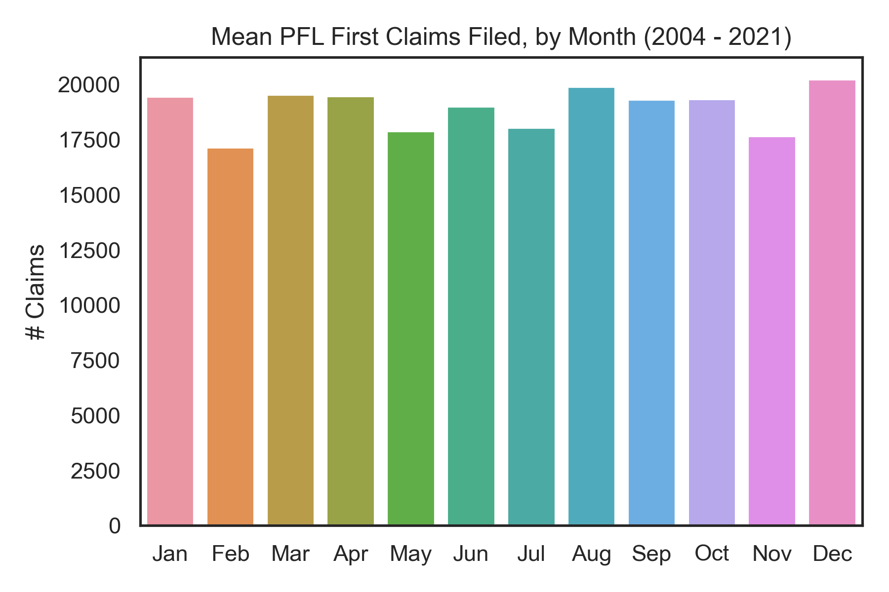
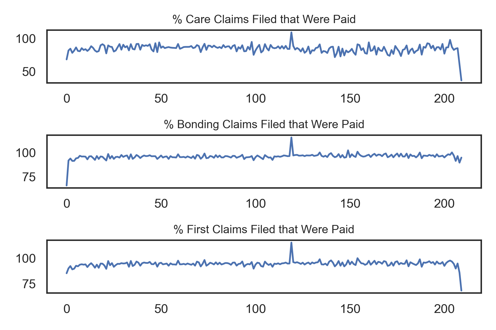
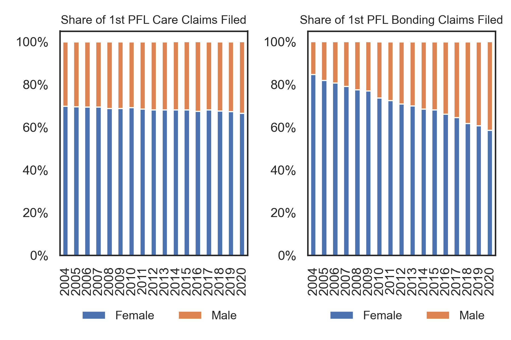
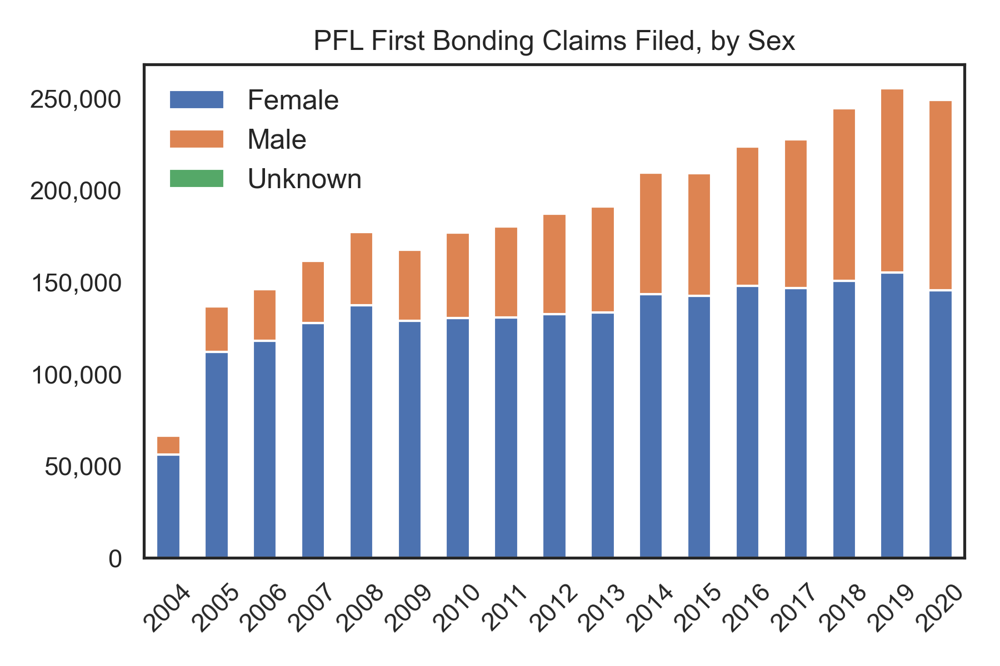
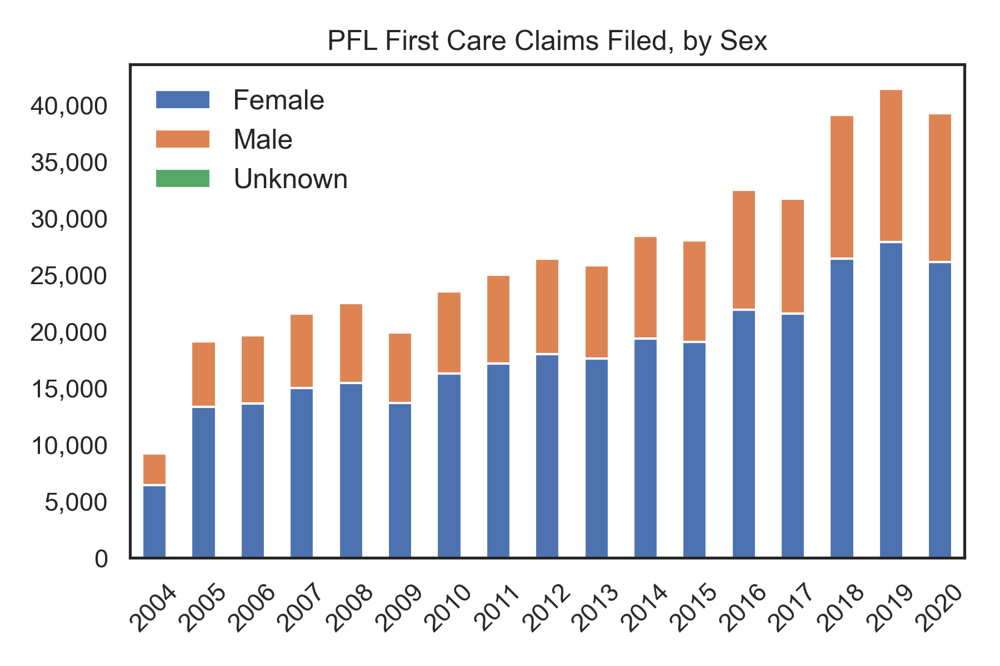
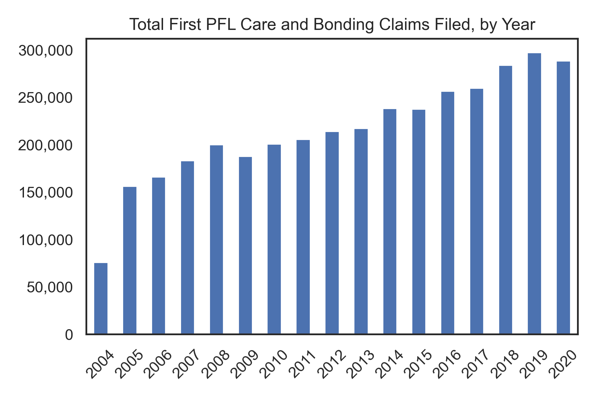
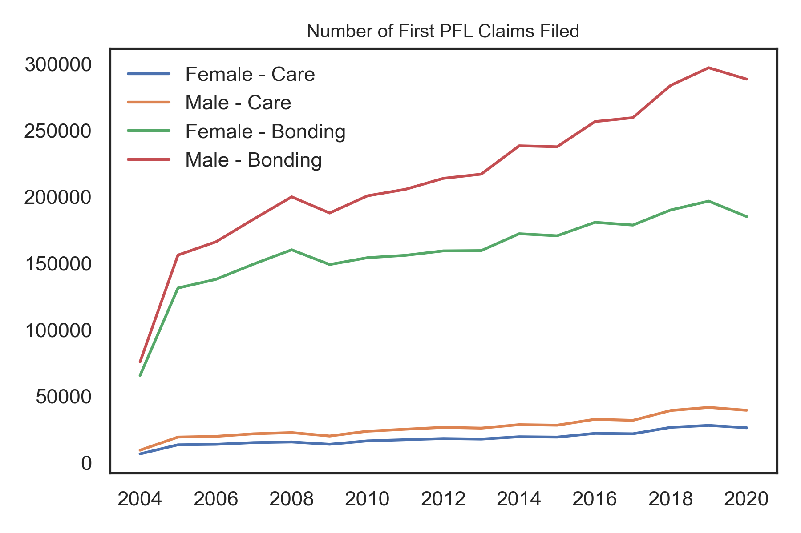
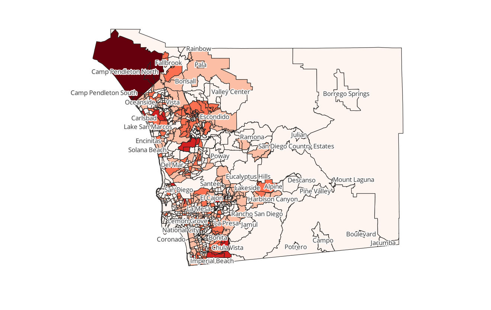
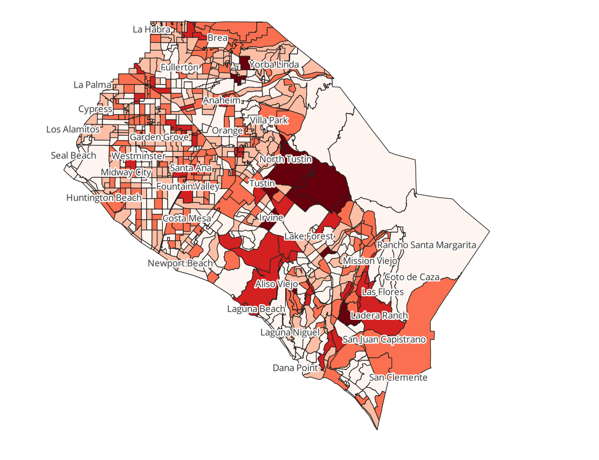
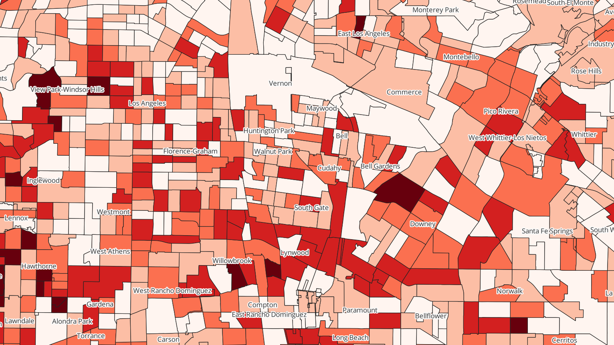

# ca_pfl_analysis

# What this repository is about:

This repository analyzes summary data about California's Paid Family Leave (PFL) program and demographic data on PFL program claimants. 
It then uses U.S. Census data to identify and locate potential beneficiaries of this program (women in the labor force who gave birth in the last 12 months), and uses QGIS to visualize where those potential beneficiaries are located geographically to inform targeted outreach.
By 'outreach,' I envision mailings to hospitals that service certain areas, major employers in those areas, and tracts in lower-income areas whose populations may have less awareness of the program.
Targeted outerach will help inform the agency's budget and resources.
Other analysts could use the methodology developed in this tool on other Census variables of interest to target outreach to different populations. 

# Main inputs and outputs, by script:

This project contains *8 scripts*, which should be run in the following order. 
See "Where to get input data" for additional instructions.
Note that due to file size constraints on GitHub.com, the .gpkg files will not be in this repository. Your scripts will build them.

1. *01_ca_pfl_import.py*
    - Purpose: This script uses the monthly summary data on the PFL program from California's Open Data Portal and applies some basic data cleaning techniques to prepare it for analysis in script 2.
    - Input: "Paid_Family_Leave__PFL__-_Monthly_Data.csv"
    - Output: "ca_pfl_data.csv" (a cleaned up version of the input)

2. *02_ca_pfl_analyze.py*
    - Purpose: This script analyzes aspects of the PFL monthly data cleaned in script 1 and plots some visualizations.
    - Input: "ca_pfl_data.csv"
    - Outputs: mean_month.png, paidvfiled.png (visualizations generated from script 2 using the input data)

3. *03_ca_claimant-demographics_import.py*
    - Purpose: This script applies some data cleaning techniques on an Excel file of claimant demographics from California's PFL program to prepare it for analysis
    in script 4.
    - Input: "Claimant Demographics-DE_2530_Rev.5_1-22.csv"
    - Output: "claimant.csv" (a cleaned up version of the input)

4. *04_ca_claimant-demographics_analyze.py*
    - Purpose: This script analyzes aspects of the claimant demographics data imported in script 3 and plots some visualizations.
    - Input: "claimant.csv"
    - Outputs: share-claims-bysex.png, bonding-claims.png, care-claims.png, total-claims.png, first-claims-bytype-bysex.png (visualizations generated from script 4 using the input data)

5. *05_acs_import.py*
    - Purpose: This script uses an API call to download data on variables of interest from the U.S. Census' American Community Survey (2018), 
    converts the data of interest to a Pandas dataframe, and writes out the dataframe to a .csv file.
    - Input: the shortlist of ACS variables of interest ("ACS2018_var.xlsx")
    - Output: "acs-data.csv" (the Census data downloaded from the API call run in script 5)

6. *06_acs_analyze.py*
    - Purpose: This script analyzes aspects of the Census data downloaded in script 5. 
    It calculates the total number of married and unmarried women in the labor force who had a birth in the last 12 months, by tract.
    Then it aggregates those counts to the county level, and identifies counties where the total number of married and unmarried women in the labor force who had a birth in the last 12 months exceeded 10,000 in the 2018 data.
    Those counties are thereafter referred to as the "big counties."
    The script then creates a dataframe of those big counties, and writes out the dataframe to a .csv file.
    - Input: "acs-data.csv"
    - Output: "big.csv" (dataframe of big counties' ACS data)

7. *07_merge.py*
    - Purpose: This script merges the ACS data on the big counties with their corresponding geographic data (tracts and places).
    It does this by reading in the data, intersecting the tracts and places, and joining the ACS data onto the intersected data.
    After some basic data cleaning and setting up the projection, it writes out the geodataframe to a geopackage file.
    - Inputs: "big.csv", "tl_2018_06_tract.zip", "tl_2018_06_place.zip"
    - Output: "merge.gpkg" (layer: "state") (a geopackage file with 1 layer: the entire state of California, with tract and place data. ACS data on big counties is also in this layer, but we will use other layers created in the next script to highlight those.)

8. *08_filter.py*
    - Purpose: This script puts each of the big counties and their corresponding places on their own layers, and prepares them for visualizing in QGIS
    - Inputs: "big.csv", "merge.gpkg"
    - Outputs: "filter.gpkg" (with the following new layers: "big_counties", "alameda", "alameda-places", "sacramento", "sacramento-places", "santaclara", "santaclara-places", "losangeles", "losangeles-places", "sandiego", "sandiego-places", "sanbernardino", "sanbernardino-places", "riverside", "riverside-places", "orange", "orange-places")
        - This output file builds upon the work done in script 7 by adding layers for the big counties as a group and each of the big counties on its own. Each of the big counties also has its own layer with the place names data.
    
After running *08_filter.py*, switch over to QGIS to create the final visualizations.
- Open QGIS. Save the project as "outreach.qgz"
- Import the data created in script 8 
    - Click "Layer," then "Add Layer," then "Add Vector Layer"
    - Select "filter.gpkg" and then confirm "Add"
    - A popup window will appear with the list of layers. There should be 18 (1 for the entire state, 1 for the big counties, and the rest for each of the big counties and their respective place layers). Add all of them. 
    - Drag the "big_counties" layer down the list until it is second to last. The "state" layer should be listed last.
- For each of the county layers (i.e., "filter - alameda"), create heat maps as follows:
    - Within "Symbology" (the icon looks like a paintbrush), switch from "No Symbols" to "Graduated"
    - Value: total_lf_b12
    - Color Ramp: Reds (ensure the lighest color corresponds with the lowest values)
    - Mode: Natural Breaks (Jenks)
    - Classes: 5
- For each of the county place layers (i.e., "filter - alameda-places"), turn on labels as follows:
    - Within "Labels" (under Symbology), switch from "No Labels" to "Single Labels"
    - Value: NAME
    - Check the box for "Draw text buffer"
- Areas with high numbers of women in the labor force who gave birth in the past 12 months can be identified using the "Identify Features" button in QGIS.
- To export images of each heatmapped county with its corresponding place names
    - Turn off every layer except the county layer and its corresponding place layer
    - Zoom in to the full county. 
    - Click "Project," then "Import/Export," then "Export Map to Image"
    - Un-check the box to "Append georeference information (embedded or via world file)"
    - Click "Save"
    - Save the file with the name of the county as the filename and .png as the format. Example: "alameda.png"
    - Repeat for each county and county-place layer pair. You will end up with eight .png files of each of the big counties.
    - Using the steps above, you can also zoom in further and export images of parts of counties if they are of interest (see losangeles-zoom.png)
- To export an image of the entire state with the big counties (state.png or bigcounties.png)
    - Turn on the "state" layer
    - Depending on what color QGIS made the state, you may want to change it (lighter is better). To do this, change the "Fill color" under Symbology.
    - Turn on all of the heatmapped county layers (but not their place layers)
    - One thing that makes it hard for the graduated heat maps to stand out when zoomed out at the state level is the thick black lines of the Census tracts. To change this, within the state layer, click "Simple Fill" then decrease the "Stroke width" to "Hairline."
    - Export a .png file of all of the big counties with their graduated heat maps and place names against the entire state.
    - An alternate version of this visualization is turning on just the "big_counties" layer and the "state" layer, ensuring they are different colors, and exporting that (bigcounties.png)
    - Note: these images are useful to the extent that they show some counties of interest are in Northern California and others are in Southern California. But since the map is zoomed out to the entire state, these images are not that useful for actual analysis.

# Where to get input data:

Data for this project comes from the following 5 sources.

1. *Monthly data on PFL claims from July 2004 - December 2021*
    - Download before running script 1, do basic cleaning in script 1, analyze in script 2
    - Go to https://data.ca.gov/dataset/paid-family-leave-pfl-monthly-data/resource/918a5226-0794-4e3e-a9a1-c82e11e0c164
    - Click the URL below the header to download the dataset: https://data.edd.ca.gov/api/views/r95e-fvkm/rows.csv?accessType=DOWNLOAD
    - Data will be downloaded with the following default name: "Paid_Family_Leave__PFL__-_Monthly_Data.csv"

2. *Yearly data on PFL claimant demographics from 2004-2020*
    - Import before running script 3, clean in script 3, anlyze in script 4
    - Go to https://edd.ca.gov/en/disability/paid-family-leave/
    - Click on the link for "Overview of California’s Paid Family Leave Program (DE 2530) (PDF)" which is https://edd.ca.gov/siteassets/files/pdf_pub_ctr/de2530.pdf
    - Download the PDF. The link will be downloaded with the following default name: "de2530.pdf" 
    - Open the PDF. Navigate to page 15 of 26 for the table "CLAIMANT DEMOGRAPHICS – PFL TOTAL FIRST CLAIMS FILED"
    - Extract data into Excel. 
        - Skip Military Assist Claims (will exclude from analysis due to a lack of data)
        - Subtract 3 claims from Total PFL Claims Filed - Female and 3 claims from Total PFL Claims Filed - Total. 
        - This takes out the 3 military assist claims filed by females in 2020 that we will exclude from the analysis.
        - Retain headings otherwise.
    - Save it as a .CSV: "Claimant Demographics-DE_2530_Rev.5_1-22.csv"

3. *U.S. Census data from the American Community Survey (ACS) 2018*
    - Download data by running script 5 using the shortlist of variables, refine in scripts 6-8

4. *TIGER/Line 2018 ACS shapefiles for California Census tracts* 
    - Download before running script 7, intersect with places data and join onto big counties data in script 7
    - Go to https://www.census.gov/geographies/mapping-files/time-series/geo/tiger-line-file.html and click 2018
    - Scroll down to "2018 TIGER/Line Shapefiles" and click "Web Interface"
    - Select year: 2018
    - Select a layer type: Census Tracts
    - Select a State: California
    - Click "Download"
    - Save file, which should be called: "tl_2018_06_tract.zip". There is no need to unzip the file.

5. *TIGER/Line 2018 ACS shapefiles for California places* 
    - Download before running script 7, intersect with tracts data and join onto big counties data in script 7
    - Go to https://www.census.gov/geographies/mapping-files/time-series/geo/tiger-line-file.html and click 2018
    - Scroll down to "2018 TIGER/Line Shapefiles" and click "Web Interface"
    - Select year: 2018
    - Select a layer type: Places
    - Select a State: California
    - Click "Download"
    - Save file, which should be called: "tl_2018_06_place.zip". There is no need to unzip the file.
 
# Main findings:

From script 2:
- The number of mean first filed PFL claims by month between 2004 - 2021 ranged from about 17,000 (February) to about 20,000 (December).

- The x axis is each record in the dataset (i.e., December 2019)
- The percentages of PFL claims filed that were paid is generally high among care, bonding, and first claims. 
- This shows claimants generally have a sufficient understanding of how to file claims such that they will successfully get paid. 

From script 4:
- The female/male share of first PFL care claims has stayed relatively constant since 2004. 
- However, the share of males filing first PFL bonding claims has increased by ~ 20 percentage points.

- Men are filing first bonding claims in increasing numbers over time.
- The number of women filing first bonding claims has hovered around the 150,00 mark for a few years now.

- Much fewer care claims (for giving care to an ill family member) are filed per year than bonding claims. Perhaps there is less awareness of this claim type.

- The number of total first PFL care and bonding claims filed by year has generally increased over time, though we see a dip in 2009 that is most likely the impact of the 2008 recession (as you have to be attached to the labor market to file a claim) and a dip in 2020 (most likely the impact of the pandemic).

- Looking at the raw numbers of claimants for each type of claim, by sex, together, shows the disparity between the number of care claims filed versus bonding claims filed overall.
- It also shows us how the number of males filing bonding claims has dramatically increased over time. 

From script 6:
- The total number of married and unmarried women in California in the labor force who gave birth in the last 12 months in the 2018 Census was 280,159.
- We saw in script 4 that the number of CA women filing first bonding claims has hovered around the 150,000 mark for a few years now.
- Not all of these women would necessary be eligible to claim PFL, but the gap is sizeable enough that we can explore opportunities for outreach with this group.
- There are 8 counties in which the number of CA women in the labor force who gave birth in the last 12 months exceeded 10,000 in the 2018 Census.

From visualizations created in QGIS:
- The Natural Breaks (Jenks) method generally created similarly scaled heatmaps for the lower bounds in each of the counties. 
- The outlier is in San Diego county. The natural breaks (lightest to darkest) are as follows: 0-31, 31-74, 74-139, 139-265, and 265-465.
- The Census tract for Camp Pendleton North, where 465 married and unmarried women in the labor force had a birth in the last 12 months in 2018. 
- Camp Pendleton is one of the largest Marine Corps bases in the U.S. Outreach could be targeted there.

- Looking at the heatmaps of the big counties (see Orange County below for example) generally shows how heterogeneous the values are across tracts.
- The natural breaks (lightest to darkest) for Orange County are as follows: 0-19, 19-48, 48-88, 88-155, and 155-243. 
- Additionally, Census tracts with the highest values (darkest red) are not always next to one another.
- This shows the added value of drilling down by tract, which is finer-grained than by county.

- This tool can also be used to zoom in to certain parts of counties for even more targeted outreach.
- For example, the below image is an excerpt of the heatmap of Los Angeles County, focusing on certain neighborhoods, many of which are lower income and/or underserved.
- The natural breaks (lightest to darkest) for Los Angeles County are as follows: 0-14, 14-34, 34-58, 58-93, and 93-157. 
- Outreach could target employers in these communities, as their employees may not be aware that they could be eligible for PFL.

